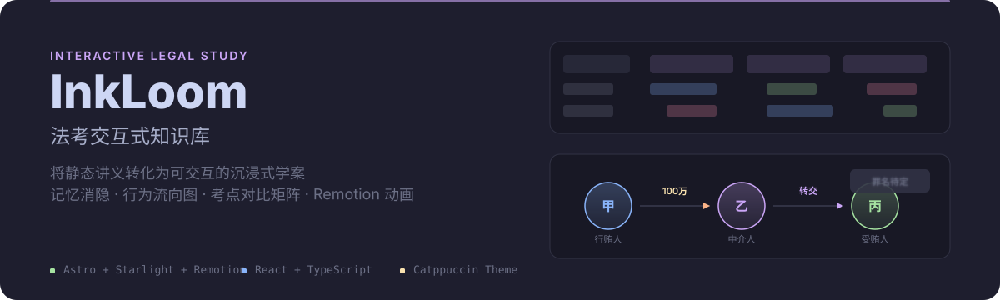
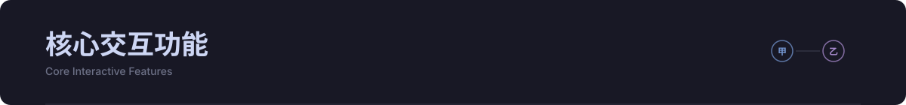

<p align="center">
  
</p>

<p align="center">
  将静态法考讲义转化为可交互的沉浸式学案站点。
</p>

<p align="center">
  <a href="https://inkloomer.github.io/inkloom">在线站点</a> ·
  <a href="#核心交互功能">功能</a> ·
  <a href="#快速开始">快速开始</a>
</p>

<br>

<p align="center">
  
</p>

### 记忆消隐背诵模式

一键开启消隐遮罩，自动模糊关键犯罪定性、数额、结论词等内容。鼠标悬停即可显现答案，专为法考背诵与自测设计。

### 交互式行为流向图

图形化「甲 → 乙 → 丙」多方行为流向图支持关联高亮。鼠标悬停于行为胶囊上自动点亮资金流向并加速流动，直观解析复杂共犯关系与贿赂截留模型。

### 考点对比记忆矩阵

整合司法解释中多重截留、代收、隐瞒、猜出等演变模型，通过横向对比矩阵列出主体、罪名、罪数处断差异，杜绝考点混淆。

### 专题视频动画（Remotion）

针对民诉「主管与管辖」等抽象程序考点，独立制作 Remotion 视频动画，将法院级别、地域管辖、专属管辖等规则转化为可视化叙事。

### 主题切换与 iframe 嵌入

内置 Catppuccin 等社区主题；支持一键导出纯净 HTML 源码，或生成 iframe 嵌入代码，可直接插入 Obsidian、Notion 等笔记工具。

<br>

<p align="center">
  
</p>

本项目提供一套面向法考内容的 Astro 组件体系：

| 组件 | 用途 |
| :--- | :--- |
| `VisualFlow` | 多方行为流向图（行贿/中介/受贿关系） |
| `ComparisonBoard` + `ComparisonRail` | 横向对比矩阵（罪名、主体、罪数） |
| `CaseCard` | 案例案情卡片 |
| `ConclusionBlock` | 结论归纳块（支持消隐） |
| `ModelAnalysis` + `ModelCard` | 刑法模型分层解析 |
| `RelationDiagram` | 法律关系拓扑图 |
| `ActionBlock` + `ActorColumn` | 行为人与行为步骤纵向编排 |
| `LegalJurisdictionPlayer` | Remotion 动画播放器封装 |

已整理内容覆盖**刑法**（贪污贿赂罪、共同受贿、利用影响力受贿）与**民诉**（主管与管辖、当事人、共同诉讼等专题），持续扩充中。

<br>

<p align="center">
  
</p>

### 安装依赖

```bash
pnpm install
```

### 启动开发服务器

```bash
pnpm dev
```

或后台模式（推荐）：

```bash
astro dev --background
```

### 构建

```bash
pnpm build
```

### 检查 Remotion 分页画面

一次生成动画每个分页的完整静帧、总览图和帧信息：

```bash
# 检查全部动画
pnpm animation:pages

# 只检查一个动画
pnpm animation:pages legal-jurisdiction
```

结果位于 `.artifacts/animation-pages/<动画 ID>/<时间戳>/`。脚本会自动发现包含
`remotion/index.ts` 与 `remotion/storyboard.ts` 的动画，无需维护单独的截图清单。

站点通过 GitHub Actions 自动部署至 `https://inkloomer.github.io/inkloom`。

<br>

## 项目结构

```
.
├── public/                     # 静态资源与动画输出
│   └── animations/
│       └── legal-jurisdiction/ # HyperFrames / Remotion 动画
├── src/
│   ├── animations/             # Remotion 动画源码
│   ├── components/             # Astro / React 交互组件
│   ├── content/docs/           # MDX 文档（法考专题内容）
│   ├── styles/custom.css       # 主题与交互动画样式
│   └── scripts/iframe-layout.ts
├── astro.config.mjs
└── package.json
```

<br>

## 技术栈

- [Astro](https://astro.build) + [Starlight](https://starlight.astro.build) — 静态站点与文档框架
- [React](https://react.dev) + [TypeScript](https://www.typescriptlang.org) — 交互组件
- [Remotion](https://www.remotion.dev) — 程序化视频动画
- [Catppuccin](https://catppuccin.com) — 主题系统

<br>

## License

[MIT](LICENSE)
